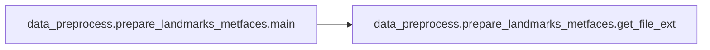

# Data Preprocess Prepare Landmarks Metfaces

[_Documentation generated by Documatic_](https://www.documatic.com)

<!---Documatic-section-Codebase Structure-start--->
## Codebase Structure

<!---Documatic-block-system_architecture-start--->
```mermaid
None
```
<!---Documatic-block-system_architecture-end--->

# #
<!---Documatic-section-Codebase Structure-end--->

<!---Documatic-section-data_preprocess.prepare_landmarks_metfaces.get_file_ext-start--->
## data_preprocess.prepare_landmarks_metfaces.get_file_ext

<!---Documatic-section-get_file_ext-start--->
<!---Documatic-block-data_preprocess.prepare_landmarks_metfaces.get_file_ext-start--->
<details>
	<summary><code>data_preprocess.prepare_landmarks_metfaces.get_file_ext</code> code snippet</summary>

```python
def get_file_ext(fname):
    return os.path.splitext(fname)[1].lower()
```
</details>
<!---Documatic-block-data_preprocess.prepare_landmarks_metfaces.get_file_ext-end--->
<!---Documatic-section-get_file_ext-end--->

# #
<!---Documatic-section-data_preprocess.prepare_landmarks_metfaces.get_file_ext-end--->

<!---Documatic-section-data_preprocess.prepare_landmarks_metfaces.main-start--->
## data_preprocess.prepare_landmarks_metfaces.main

<!---Documatic-section-main-start--->


### Object Calls

* data_preprocess.prepare_landmarks_metfaces.get_file_ext

<!---Documatic-block-data_preprocess.prepare_landmarks_metfaces.main-start--->
<details>
	<summary><code>data_preprocess.prepare_landmarks_metfaces.main</code> code snippet</summary>

```python
def main(args):
    detect_base_dir = os.path.join(args.save_dir, 'detections')
    detect_res_dir = os.path.join(detect_base_dir, 'results')
    os.makedirs(detect_res_dir, exist_ok=True)
    detector = MTCNN()
    sorted_f_list = sorted(list(glob.glob(os.path.join(args.data_dir, '*.png'))))
    print('\nsorted_f_list: ', len(sorted_f_list), sorted_f_list[:5], '\n')
    for (i, f_path) in tqdm.tqdm(enumerate(sorted_f_list), total=len(sorted_f_list)):
        basename = os.path.splitext(os.path.basename(f_path))[0]
        if pyspng is not None and get_file_ext(f_path) == '.png':
            with open(f_path, 'rb') as fin:
                img = pyspng.load(fin.read())
        else:
            img = np.array(PIL.Image.open(f_path))
        if args.xflip == 1:
            tmp_f_path = f"{f_path.split('.png')[0]}_xflip.png"
            ImageOps.mirror(Image.fromarray(img)).save(tmp_f_path)
        else:
            text_path = f'{detect_res_dir}/{basename}.txt'
            result = detector.detect_faces(img)
            try:
                keypoints = result[0]['keypoints']
                with open(text_path, 'w') as f:
                    for value in keypoints.values():
                        f.write(f'{value[0]}\t{value[1]}\n')
            except:
                if i == 0:
                    mode = 'w'
                else:
                    mode = 'a'
                with open(os.path.join(detect_base_dir, 'fail_list.txt'), mode) as fail_f:
                    fail_f.write(f'{os.path.basename(f_path)}\n')
                print('\n[fail] ', os.path.basename(f_path), '\n')
    if not os.path.exists(os.path.join(detect_base_dir, 'fail_list.txt')):
        with open(os.path.join(detect_base_dir, 'fail_list.txt'), 'w') as fail_f:
            fail_f.write(f'\n')
```
</details>
<!---Documatic-block-data_preprocess.prepare_landmarks_metfaces.main-end--->
<!---Documatic-section-main-end--->

# #
<!---Documatic-section-data_preprocess.prepare_landmarks_metfaces.main-end--->

[_Documentation generated by Documatic_](https://www.documatic.com)